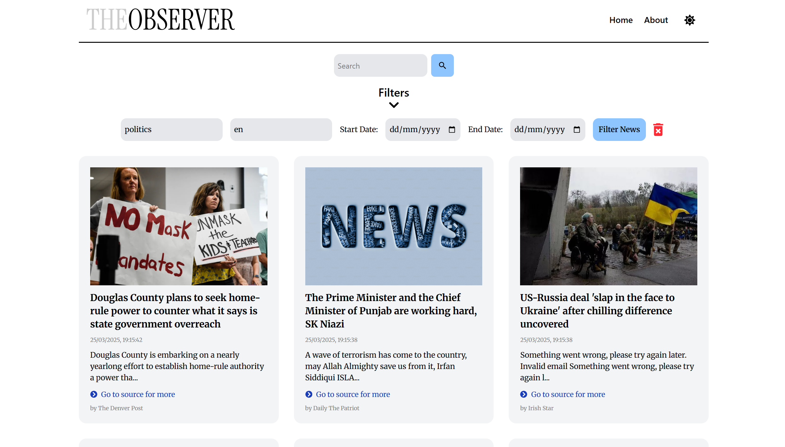

# The Observer

**The Observer** is a simple news aggregator web app that fetches news from the [NewsDataHub API](https://newsdata.io/) and displays them to users. Users can filter news based on topics, languages, and dates, or search for specific articles. This project is built using React, styled with Tailwind CSS, and uses Vite for fast development.



## Features
- Fetches real-time news data from the [NewsDataHub API](https://newsdata.io/).
- Filter news articles by topics, languages, or dates.
- Search news articles by keywords.
- Lightweight and fully client-side (no backend).

## Tech Stack
- **Frontend**: React, Vite, Tailwind CSS
- **API**: NewsDataHub API (for fetching news)
- **Deployment**: Local development (not live)

## Installation

Clone the repository:

```bash
git clone https://github.com/benenesgunes/the-observer.git
```
Navigate into the project directory:
```bash
cd the-observer
```
Install dependencies:
```bash
npm install
```
Start the development server:
```bash
npm run dev
```

Open your browser and go to http://localhost:3000 to view the app.

## Usage

- Use the search bar to find specific news articles.
- Filter news by topics, languages, or dates using the available filters.

## License

This project is a nonprofit, solo initiative and is licensed under the MIT License.

## Contributing

As this is a solo project, contributions are not currently being accepted, but feel free to open an issue if you encounter any bugs.
